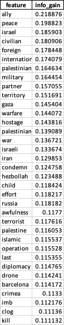
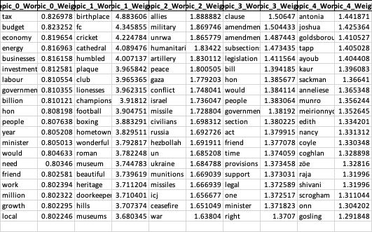
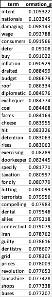

# IR 2025 – UK Parliament Hansard Project

This project works with UK Parliament debate transcripts (Hansard).  
We download XML debates, clean the text, build BM25 vectors, cluster the documents, and rank important words using different feature-selection and topic-modeling methods.

---

## 1. Download Debates (XML)

In this part we download the raw debate files from the public Hansard website.

We wrote a download function that:
- Starts from a given debate name (for example `debates2023-06-28d.xml`).
- Reads the remote index page of the debates folder.
- Finds all XML debate links.
- Downloads each XML file and saves it locally (skipping files that already exist).

---

## 2. Cleaning Text

So we have raw XML files with debates. Now we need to extract clean text.
We had a problem: the XML structure is complex, with nested tags, metadata, and non-speech content with each date containing multiple files some with the data and others with redirections and small bits of data within.
to solve this for each date we combined all XML files into one big  file per date with all the `
` tags.
We wrote a cleaning function that:
- Parses the XML.
- Extracts only the relevant text (inside `
` tags).
- Removes XML tags.

## 3. tokenization and lemmatization
now that we have clean text we need to tokenize and lemmatize it.
to do that we had to choose between nltk and spacy.
after some research we found that nltk was much faster, but after running the code we saw that it missed spacing certain punctuation marks.
so we chose spacy for its better accuracy even though it was slower and more time consuming.

## 4. BM25 – Building Per-Document Vectors

In this part we take the cleaned `.txt` files and turn them into BM25-weighted vectors, one JSON file per document.

### What we did

We:

- Load all `.txt` files from two folders:
  - `data/tokenized_text_spacy`  → word-based version.
  - `data/lemmatized_files`      → lemmatized version.
- Tokenize and clean the text using NLTK:
  - Convert to lowercase.
  - Use `word_tokenize`.
  - Keep only alphabetic tokens (`w.isalpha()`).
  - Remove English stopwords (`STOP_WORDS`).
- Filter rare words:
  - Count term frequency across all documents with `Counter`.
  - Keep only words that appear in at least `min_freq` documents (we used `min_freq = 5`).
- Build a BM25 model with `BM25Okapi(docs)` for each version (word / lemma).
- For each document:
  - Count term frequencies in that document (`Counter(doc_tokens)`).
  - For each term that appears in this document:
    - Compute the BM25 score using the same formula as `BM25Okapi`:
      \[
      \text{score}(t, d) = idf(t) \cdot \frac{f(t,d)\cdot(k_1+1)}{f(t,d) + k_1\cdot(1 - b + b\cdot |d|/\text{avgdl})}
      \]
    - Store `term → score` in a Python dict.
  - Save the dict as a JSON file: `filename.txt → filename.json`.

We do this twice:

- **BM25-Word** → output: `models/bm25_word_json_dict/*.json`  
- **BM25-Lemm** → output: `models/bm25_lemm_json_dict/*.json`

Later (in other scripts) we load these JSON files and **then** use `DictVectorizer` to create a sparse matrix for clustering and feature selection.

### Dilemmas and options

- **optimize for speed**
    - Naive version: for each document, loop over all terms in the global vocabulary (very slow).
    - Optimized version: for each document, loop only over unique terms in that document (`Counter(doc_tokens)`).
    - We implemented the **optimized version** in `save_json_vectors_optimized(...)`.

- **Where to filter rare words**
  - Option 1: Filter rare terms later, on the matrix level.
  - Option 2: Filter rare terms early, before BM25, to make everything lighter.
  - We chose **Option 2** (function `filter_rare_words`) so BM25, JSON size, and all later steps are smaller and faster.

- **How to compute BM25 scores**
  - Option 1: Use only the built-in `.get_scores()` for queries.
  - Option 2: Reuse the BM25 formula and compute per-document scores for all terms.
  - We chose **Option 2**, and manually applied the BM25 formula using `bm25.idf`, `bm25.k1`, `bm25.b`, `bm25.avgdl`, so that each document gets a full vector.

- **Performance**
  - Naive version: loop over all terms in the global vocabulary for each document (very slow).
  - Optimized version: for each document, loop only over unique terms in that document (`Counter(doc_tokens)`).
  - We implemented the **optimized version** in `save_json_vectors_optimized(...)`.

### Tech used

- **Text processing**
  - `nltk.word_tokenize` – tokenize text.
  - `nltk.corpus.stopwords` – English stopword list.
  - Lowercasing and `str.isalpha()` – cleaning tokens.

- **BM25 implementation**
  - `rank_bm25.BM25Okapi` – for IDF, `k1`, `b`, `avgdl`.
  - Manual BM25 score computation per term per document.

- **Frequency filtering**
  - `collections.Counter` – to count term frequency across all documents and inside each document.
  - `filter_rare_words(docs, min_freq=5)` – keep only frequent enough terms.

- **Input / Output**
  - Input folders:
    - `data/tokenized_text_spacy/`
    - `data/lemmatized_files/`
  - Output folders:
    - `models/bm25_word_json_dict/`
    - `models/bm25_lemm_json_dict/`
  - Format:
    - One JSON per document: `{ "term": bm25_score, ... }`

- **Main functions**
  - `load_texts(folder_path)` – read `.txt` files, tokenize, clean, remove stopwords.
  - `filter_rare_words(docs, min_freq)` – remove rare terms globally.
  - `save_json_vectors_optimized(docs, filenames, output_dir, vocab)` – build BM25 vectors and save them as JSON.
---

## 5 SimCSE Document Vectors

In this part we create dense document vectors using a SimCSE model from the `sentence-transformers` library.

### What we did

- Loaded all debate texts from `data/combined_xml_files/` and collected:
  - `all_texts` – list of full document texts.
  - `all_names` – matching filenames.
- Loaded a SimCSE model with `SentenceTransformer(...)`.
- Checked if GPU (MPS on M1/M2) is available and used it when possible.
- Encoded all texts with:
  - `model.encode(all_texts, show_progress_bar=True, batch_size=32, convert_to_numpy=True)`
- Saved each document vector as a JSON file in `models/simcse_origen/`:
  - `{"vector": [v1, v2, ..., vD]}`

### Dilemmas and options

- **Whole document vs. sentence-level:**
  - Option 1: Split each debate into many sentences and embed each sentence.
  - Option 2: Treat each debate file as one long text and embed the whole document.
  - We chose **Option 2** to keep one vector per document and make clustering/comparison easier.
- **Model choice:**
  - We considered different SimCSE checkpoints and chose one pre-trained English model that balances quality and speed.
- **Hardware:**
  - We added optional GPU/MPS support to speed up encoding on Apple Silicon, but kept it working on CPU as well.

### Tech used

- `sentence_transformers.SentenceTransformer` – SimCSE model loading and encoding.
- `torch` – to detect and use GPU/MPS if available.
- `tqdm` – progress bar while encoding many documents.
- `json`, `os`, `glob` – file handling and saving vectors.
- Output: one JSON vector file per document in `models/simcse_origen/`.

---

## 6 SBERT Document Vectors

In this part we create document vectors using an SBERT (Sentence-BERT) model, also from `sentence-transformers`.

### What we did

- Loaded the same set of debate texts (one text per document).
- Loaded an SBERT model with `SentenceTransformer(...)` (for example an `all-*` English model).
- Used the same encoding pattern:
  - `model.encode(all_texts, show_progress_bar=True, batch_size=32, convert_to_numpy=True)`
- Saved each document vector as a JSON file in a dedicated SBERT models folder
  (e.g. `models/sbert_*`), with the format:
  - `{"vector": [v1, v2, ..., vD]}`

### Dilemmas and options

- **SimCSE vs. SBERT:**
  - SimCSE is trained with contrastive learning for sentence similarity.
  - SBERT uses a siamese network architecture directly optimized for sentence-pair tasks.
  - We decided to generate both SimCSE and SBERT vectors so we can compare:
    - cluster quality,
    - document similarity,
    - and possibly retrieval performance.
- **Same documents, different embeddings:**
  - We kept the input texts identical so differences in results come only from the model, not from the data.

### Tech used

- `sentence_transformers.SentenceTransformer` – SBERT model.
- Same infrastructure as SimCSE:
- `torch` for device selection.
- `tqdm` for progress bar.
- `json`, `os`, `glob` for file IO.

---

## 7. SVD + K-Means Clustering + Feature Importance 

In this solution we reduce the BM25 matrix with SVD, then cluster with K-Means, then rank important words.

Steps:
1. Use `DictVectorizer` to build a BM25 matrix.
2. Apply `TruncatedSVD` to reduce from thousands of terms to a smaller number of components (e.g. 50).
3. Run `KMeans` on the reduced matrix to find document clusters.
4. Use the final cluster labels as pseudo-labels `y`.
5. Compute feature importance (Information Gain, Chi-Squared) on the *original* BM25 matrix using these labels.
6. Export top words per method to Excel.

**Dilemmas and options**

- We had to decide:
  - Whether to cluster directly on the huge sparse matrix or on reduced SVD data.  
    We chose SVD first, because it is faster and less noisy.
  - How to choose K (number of clusters).  
    We tried several values and then fixed a reasonable one based on silhouette score and manual inspection.

**Visual comparison**

| Words | Lemmas |
| --- | --- |
|  |  |
|  |  |

The paired plots show the top-20 Chi-Squared and Information Gain terms for words vs. lemmas.

---

## 8. NMF Topic Modeling 

This solution uses NMF (Non-negative Matrix Factorization) to find topics instead of clusters.

Steps:
1. Ensure BM25 matrix is non-negative (shift if necessary).
2. For a chosen number of topics `K`, run `NMF` on the BM25 matrix.
3. Get:
   - `W` (document–topic matrix): how much each topic appears in each document.
   - `H` (topic–word matrix): how important each word is for each topic.
4. For each topic:
   - Select top N words (e.g. 20) with highest weights.
5. Save:
   - Topic keywords.
   - Mapping from documents to their strongest topic.

**Dilemmas and options**

- We had to choose:
  - How many topics `K` to use (too small = mixed topics, too large = noisy topics).  
    We tried several K values and chose one that gave understandable topics.
  - Whether to apply SVD before NMF or not.  
    We used NMF directly on BM25 (after fixing negative values).

**Tech used**

- Topic modeling:
  - `sklearn.decomposition.NMF`
- Matrix operations:
  - Use `W` and `H` to extract top words and topic strength.
- Output:
  - Excel:
    - Sheet with topic keywords.
    - Sheet mapping `Filename → Predicted_Topic + Topic_Strength`.

**Visual comparison**

| Words | Lemmas |
| --- | --- |
|  |  |

Each panel lists the top 20 words associated with every NMF topic.
---

## 9. K-Means + Manual Information Gain from Clusters 

This script focuses only on using K-Means plus a manual formula for Information Gain.

Steps:
1. Load BM25 JSON and build a sparse matrix.
2. Run `KMeans` with a fixed number of clusters (e.g. 10).
3. For each document:
   - Assign a label like `cluster_0`, `cluster_1`, …
4. For each term:
   - Count how often it appears in each cluster.
   - Compute entropy of labels before and after “splitting” by this term:
     - Documents **with** the term (X = 1)
     - Documents **without** the term (X = 0)
   - Information Gain = `H(Y) − H(Y | X)`.
5. Sort terms by IG and export to Excel.

**Tech used**

- Clustering:
  - `sklearn.cluster.KMeans`
- Manual IG:
  - `math.log2` and our own `compute_entropy(...)` and `compute_information_gain_from_clusters(...)`.
- Output:
  - Excel file with:
    - Column `term`
    - Column `information_gain`
    - Sorted in descending order.

**Visual comparison**

| Words | Lemmas |
| --- | --- |
|  |  |

These bar charts summarize the manual information-gain ranking for word vs. lemma representations.
---
